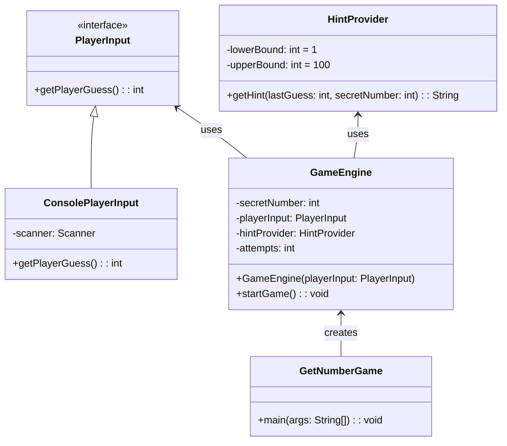

# AlgorithmsDataStructuresJava2024
### Чіткий опис вимог для гри "Вгадай число":
1. Опис гри:
   - Комп'ютер загадує випадкове число від 1 до 100.
   - Гравець вводить спроби відгадати це число.
   - Після кожної спроби комп'ютер повідомляє гравцеві, чи введене число більше або менше загаданого.

2. Розширення гри:
   - Алгоритм підказок: Додати можливість звузити діапазон можливих чисел на основі попередніх спроб гравця. 
    Наприклад, якщо гравець ввів 30 і комп'ютер відповів, що загаданe число більше, то наступна підказка може повідомити, що число знаходиться у діапазоні 31-100.

### Вимоги до гри:
1. Число загадується випадково: Гра повинна використовувати генератор випадкових чисел для визначення загаданого числа в діапазоні від 1 до 100.
2. Інтерактивний інтерфейс: Гравець вводить число через консоль або графічний інтерфейс (для простоти будемо використовувати консоль).
3. Повідомлення про результат спроби: Гравець отримує інформацію після кожної спроби - чи число більше або менше загаданого.
4. Підказки: Алгоритм підказок допомагає звузити можливий діапазон чисел.

UML diagramm

